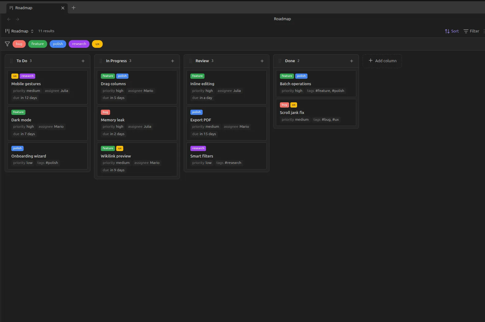
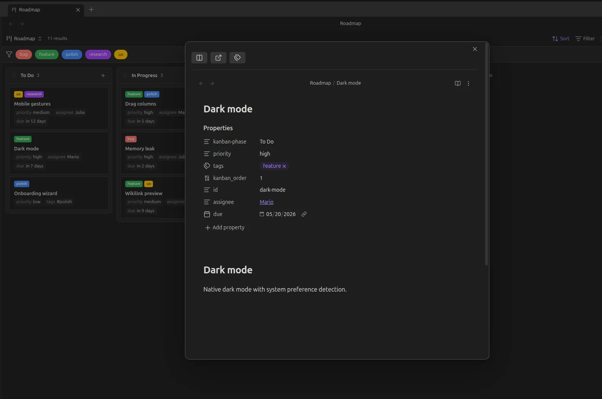

# AI Tasks

AI Tasks é um gerenciador de tarefas local-first baseado em Markdown, com uma interface visual no Obsidian e uma skill para operar o board por linguagem natural. Não há aplicação, API ou banco de dados próprios.

Clone o repositório e use o vault para tarefas pessoais, trabalho, estudos ou qualquer outro contexto. Os arquivos permanecem legíveis e editáveis sem o Obsidian.





_Exemplos da interface fornecida pelo plugin [Base Board](https://community.obsidian.md/plugins/base-board). Os cards das imagens são apenas ilustrativos e não fazem parte deste repositório._

## Início rápido

### 1. Clone o repositório

O mesmo comando funciona no PowerShell, Terminal do macOS e shells Linux:

```shell
git clone https://github.com/nathancarvalhocota/ai-tasks.git
cd ai-tasks
```

### 2. Prepare o Obsidian

No Obsidian, um **vault** é apenas uma pasta local contendo notas e configurações. Neste projeto, a própria pasta clonada é o vault; não é necessário criar outro.

1. [Baixe e instale o Obsidian](https://obsidian.md/download) para seu sistema operacional.
2. Abra o Obsidian e selecione **Open folder as vault**.
3. Escolha a pasta `ai-tasks` que acabou de clonar.
4. Se o Obsidian pedir confirmação para confiar no conteúdo do vault, revise o repositório e confirme para continuar.
5. Abra **Settings** pelo ícone de engrenagem no canto inferior esquerdo.
6. Entre em **Core plugins**, procure **Bases** e habilite-o.
7. Entre em **Community plugins** e selecione **Turn on community plugins** para sair do modo restrito.
8. Confirme que **Base Board** está habilitado. A versão compatível do plugin já vem no repositório; não é necessário procurá-lo nem instalá-lo separadamente.
9. Feche as configurações e, no explorador de arquivos à esquerda, abra `Tasks.base`.

O board já vem configurado com as colunas **To Do**, **In Progress**, **Done** e **Cancelled**. Não execute o comando de criar um novo board e não crie as colunas manualmente.

O plugin **Obsidian Git** é opcional e não vem no repositório. Se desejar usá-lo, instale-o pelo catálogo de plugins comunitários. Ele oferece comandos Git dentro do Obsidian, mas não participa do formato ou da automação das tarefas.

### 3. Instale a skill `ai-tasks`

O repositório contém uma única skill lógica, distribuída nos formatos esperados por Codex e Claude Code. No PowerShell, execute a opção correspondente a partir da raiz do clone:

```powershell
# Codex
$codexSkillDirectory = Join-Path $HOME ".agents\skills\ai-tasks"
New-Item -ItemType Directory -Force $codexSkillDirectory | Out-Null
Copy-Item ".\.agents\skills\ai-tasks\*" $codexSkillDirectory -Recurse -Force

# Claude Code
$claudeSkillDirectory = Join-Path $HOME ".claude\skills\ai-tasks"
New-Item -ItemType Directory -Force $claudeSkillDirectory | Out-Null
Copy-Item ".\.claude\skills\ai-tasks\*" $claudeSkillDirectory -Recurse -Force
```

Em macOS ou Linux:

```bash
# Codex
mkdir -p ~/.agents/skills/ai-tasks
cp -R .agents/skills/ai-tasks/. ~/.agents/skills/ai-tasks/

# Claude Code
mkdir -p ~/.claude/skills/ai-tasks
cp -R .claude/skills/ai-tasks/. ~/.claude/skills/ai-tasks/
```

Reinicie o agente depois da instalação. A skill é acionada somente quando você a invoca explicitamente.

### 4. Faça a primeira chamada

Inicie o agente na raiz deste repositório e peça uma operação:

```text
# Codex
$ai-tasks crie uma tarefa para revisar o planejamento semanal

# Claude Code
/ai-tasks crie uma tarefa para revisar o planejamento semanal
```

Na primeira execução, a skill reconhece o vault atual e registra seu caminho em `~/.ai-tasks/config.json`. Esse arquivo é local e não faz parte do repositório. Depois disso, `ai-tasks` pode ser chamada enquanto o agente trabalha em qualquer outra pasta.

Se o vault for movido, invoque a skill a partir da nova raiz para atualizar a configuração.

## Usar a skill

Após o setup, descreva a operação em linguagem natural:

```text
/ai-tasks crie uma tarefa para pesquisar opções de hospedagem
/ai-tasks liste tarefas relacionadas a documentação
/ai-tasks mova a tarefa de hospedagem para Fazendo
/ai-tasks adicione este documento à tarefa de hospedagem
/ai-tasks conclua a tarefa depois de validar os critérios de aceitação
```

Não é necessário memorizar o nome exato de uma tarefa. A skill pesquisa ID, título, tags e conteúdo; quando mais de um card corresponder ao pedido, ela apresenta as opções antes de alterar qualquer um deles.

O Obsidian pode permanecer fechado. A skill lê e grava os arquivos diretamente; ao abrir o vault, o board reflete as alterações.

## Board

O board possui quatro estados fixos:

| Estado persistido | Significado |
| --- | --- |
| `To Do` | A fazer |
| `In Progress` | Fazendo |
| `Done` | Feito |
| `Cancelled` | Cancelado |

Os arquivos usam exatamente os valores da primeira coluna, mesmo quando o pedido ao agente estiver em outro idioma. Cards são movidos visualmente apenas por drag and drop. As colunas não são criadas, renomeadas, reordenadas ou removidas.

## Estrutura do vault

```text
.
├── .agents/skills/ai-tasks/   # distribuição para Codex
├── .claude/skills/ai-tasks/   # distribuição para Claude Code
├── .obsidian/plugins/base-board/ # interface Kanban incluída
├── docs/task-card.md           # contrato compartilhado
├── Tasks/
│   └── <título-do-card>/
│       ├── <título-do-card>.md
│       └── attachments/
└── Tasks.base
```

Cada card é uma pasta. A nota Markdown guarda sua identidade, estado e conteúdo; `attachments/` recebe imagens e outros arquivos daquele card e só é criada quando necessária.

Não há template do Obsidian. O formato, a identificação e as operações estão definidos uma única vez em [`docs/task-card.md`](docs/task-card.md). As distribuições da skill encaminham os agentes para esse contrato.

## Obsidian CLI opcional

O CLI do Obsidian não é usado pela skill. Caso esteja habilitado, ele pode abrir e consultar o board enquanto o aplicativo desktop estiver rodando:

```powershell
obsidian open path="Tasks.base"
obsidian base:query path="Tasks.base" view="Tasks" format=md
```

## Versionamento e privacidade

Configurações compartilháveis do Obsidian e o runtime fixado do Base Board são versionados. Estado da interface, configurações locais e outros plugins instalados são ignorados.

O Base Board é software de terceiros distribuído sob a licença MIT. A licença e a atribuição originais estão em [`.obsidian/plugins/base-board/LICENSE`](.obsidian/plugins/base-board/LICENSE).

Cards em `Tasks/` também são arquivos Git. Use um repositório privado quando as tarefas puderem conter informações sensíveis. A skill só executa commit ou push quando isso for pedido explicitamente.
